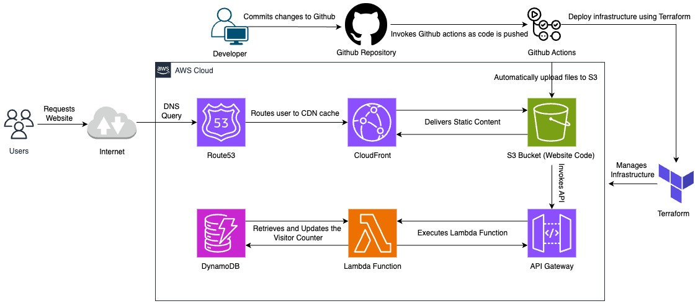

# Cloud Resume Challenge

## Description

This project is based on "The Cloud Resume Challenge" by Forrest Brazeal, leveraging various AWS services to build and host a resume online. The challenge was a practical application of my AWS Cloud Practitioner certification.

## Project Breakdown

### Building the Frontend

- **Technology**: Developed using Vue.js and styled with TailwindCSS.
- **Hosting**: Hosted on Amazon S3 for reliable and accessible static website hosting.
- **Domain Management**: Used a custom subdomain managed by AWS Route 53 for better integration.
- **Security**: SSL/TLS certificates managed by AWS Certificate Manager and content served through CloudFront for secure and fast content delivery globally.

### Building the API

- **Visitor Tracking**: Implemented visitor count tracking using AWS DynamoDB and AWS Lambda.
- **DynamoDB**: Set up a table to store the visitor count.
- **Lambda Function**: Created a Python function to update the count on each visit.
- **API Gateway**: Configured to securely invoke the Lambda function, handling CORS issues to allow frontend requests.

### Frontend and Backend Integration

- **CORS Handling**: Configured API Gateway to allow cross-origin requests from the frontend.
- **Dynamic Content**: Displayed the visitor count on the website using JavaScript to fetch data from the API Gateway.

### Automation CI/CD

- **GitHub Actions**: Automated deployment process for both frontend and backend updates.
- **Terraform**: Managed infrastructure as code to automate AWS resource deployment, enhancing reliability and reducing errors.

### Additional Features

- **Google Analytics**: Integrated to track and analyze website traffic, providing insights into user engagement.

## Conclusion

This challenge was an excellent way to apply and expand my AWS skills. I built a fully functional cloud-hosted resume, learning new techniques and best practices along the way.

For any questions or to start a similar project, feel free to reach out. Connect with me on [LinkedIn](https://www.linkedin.com/in/m-fazeel/).

[View the website here](https://resume.mfazeel.com)
